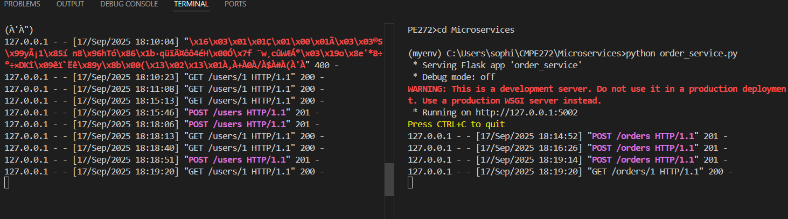

# Microservices Architecture – Class Assignment

This project demonstrates a simple **microservices architecture** using **Python** and **Flask**.  
The system is composed of two independent services:

1. **User Service** – manages users.  
2. **Order Service** – manages orders and fetches user info from the User Service.  

Both services run separately and communicate over HTTP requests.

---

## 📸 Screenshots

-   
-   
